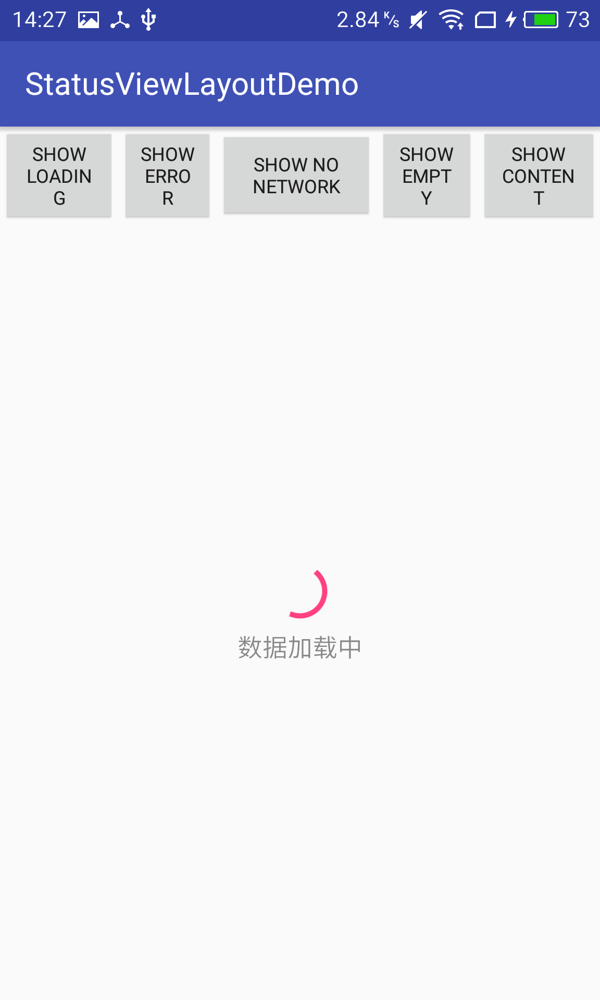
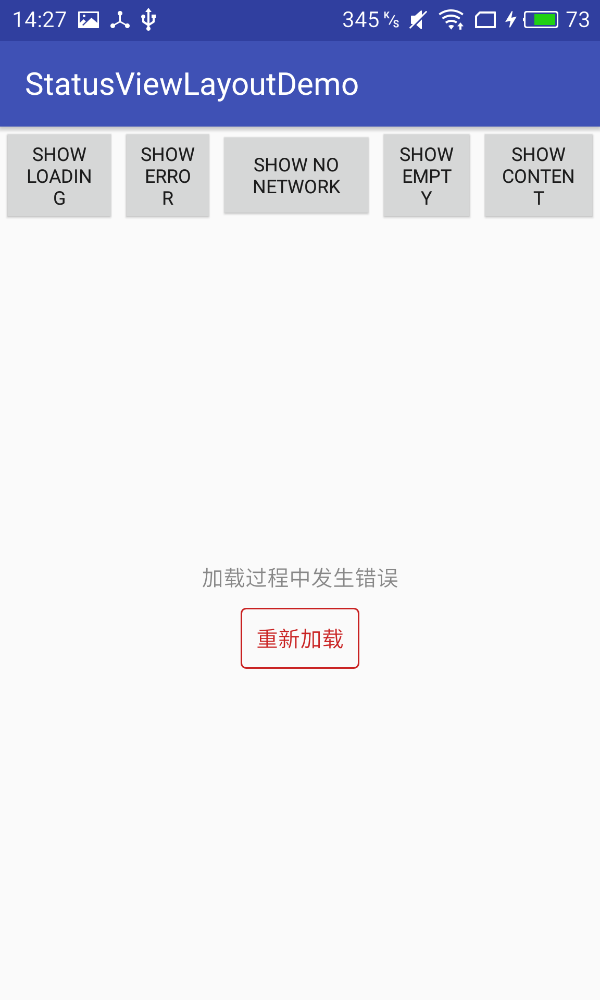
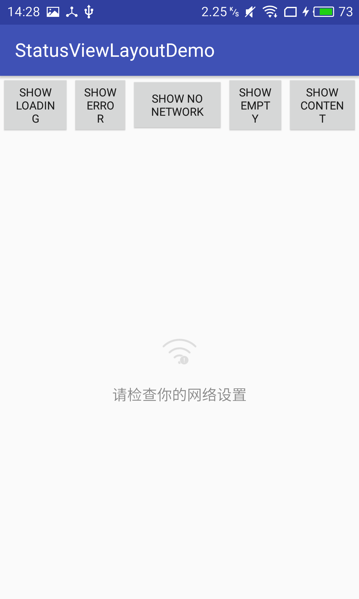
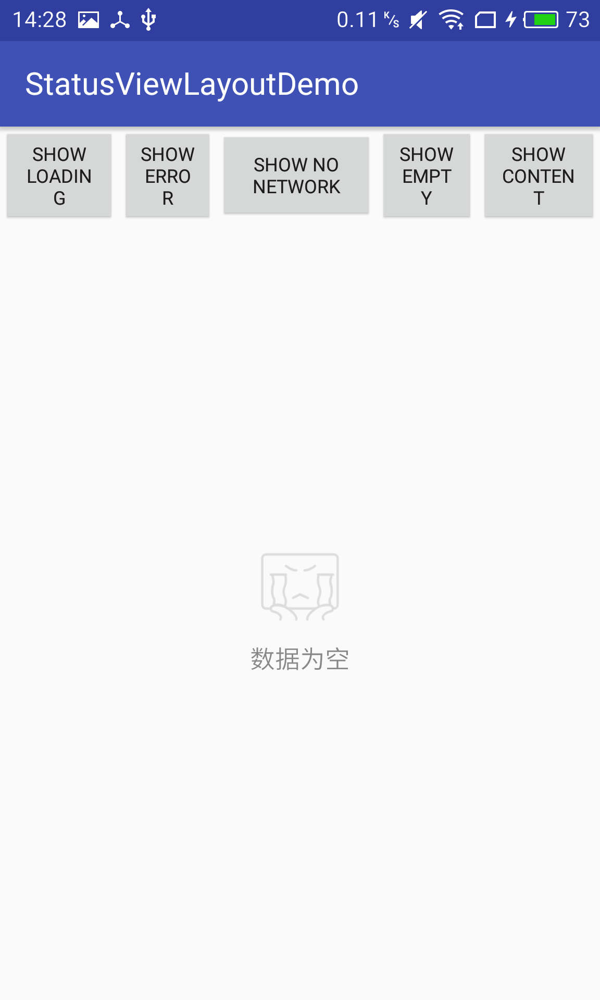

[ ](https://bintray.com/solid/maven/StatusViewLayout/_latestVersion)

An library can very easily manage view's status.

###Download
 ```html
  compile 'me.solidev.library:status-view-layout:latestVersion'
 ```
###Capture

 
 
 
 
